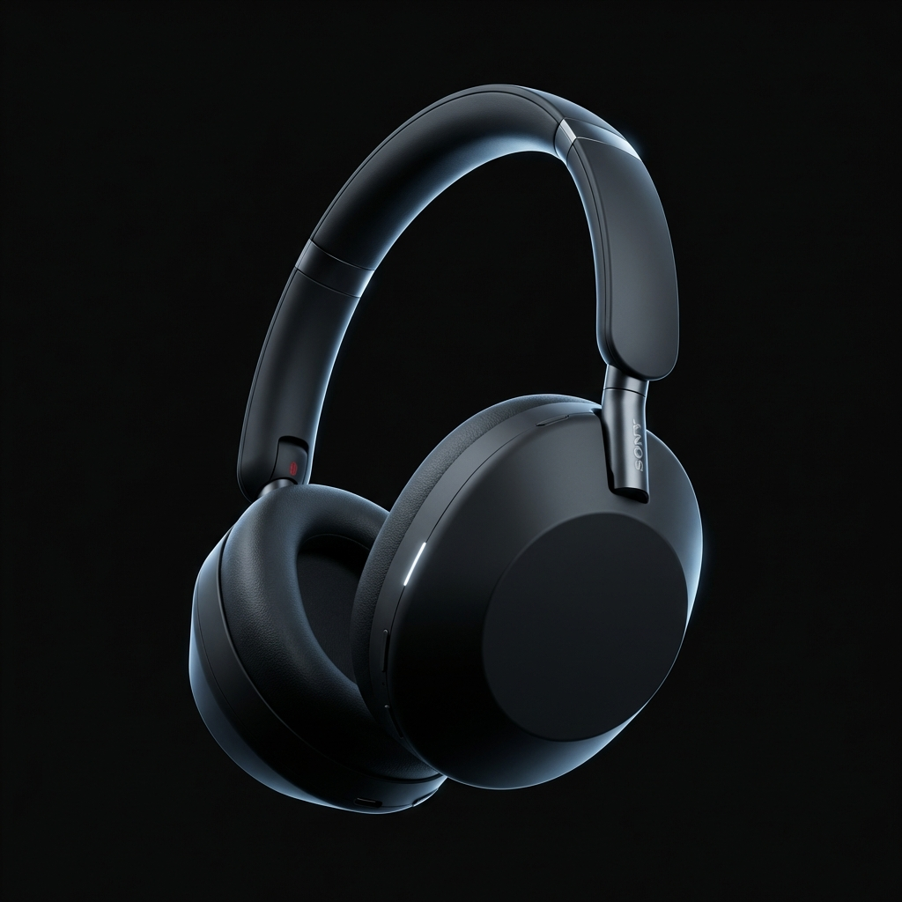
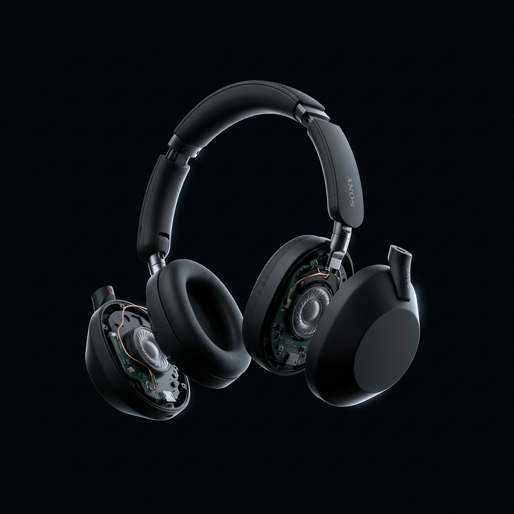

# AirPods Pro Landing Page - Scrollytelling Experience

This is a premium, Apple-inspired landing page built for AirPods Pro, featuring a highly interactive scrollytelling experience.



## Overview

This project showcases a full-screen, high-performance scroll-linked animation sequence using the HTML5 `<canvas>`. As the user scrolls, a 240-frame image sequence plays, visually "exploding" and reassembling the AirPods to highlight different features.



## Features

- **Performance-Optimized Scrollytelling**: Custom canvas implementation for 60fps image sequence playback linked to scroll position.
- **Dynamic Text Overlays**: Narrative text fades in and out precisely synced with the 3D model animations.
- **Glassmorphic Navigation**: A sticky, blur-backed navigation bar (using framer-motion) that adapts to the dark theme.
- **Premium Apple-Style Aesthetics**: High contrast dark theme, minimalist typography (Inter/SF Pro), and subtle gradient accents.
- **Commerce Capabilities**: An integrated React Context-powered slide-out cart sidebar where users can add and review products.
- **Deep-Dive Feature Pages**: Includes sub-pages for `/audio`, `/specs`, and `/noise-cancellation` with detailed components.

## Tech Stack

- **Framework**: [Next.js 14](https://nextjs.org) (App Router)
- **Styling**: [Tailwind CSS](https://tailwindcss.com) 
- **Animations**: [Framer Motion](https://www.framer.com/motion/)
- **Language**: TypeScript

## Getting Started

First, install the dependencies:

```bash
npm install
# Ensure you have lucide-react and framer-motion installed
npm install framer-motion lucide-react
```

Then, run the development server:

```bash
npm run dev
```

Open [http://localhost:3000](http://localhost:3000) with your browser to experience the landing page.

## Project Structure

- `app/page.tsx`: The main orchestration file containing the TextOverlays and layout.
- `components/ImageSequence.tsx`: The core canvas animation logic.
- `components/TextOverlay.tsx`: Reusable text reveal component based on scroll percentages.
- `components/Cart.tsx` & `context/CartContext.tsx`: The commerce layer.
- `public/airpods/`: (Requires generating or importing your own 240-frame image sequence here).
